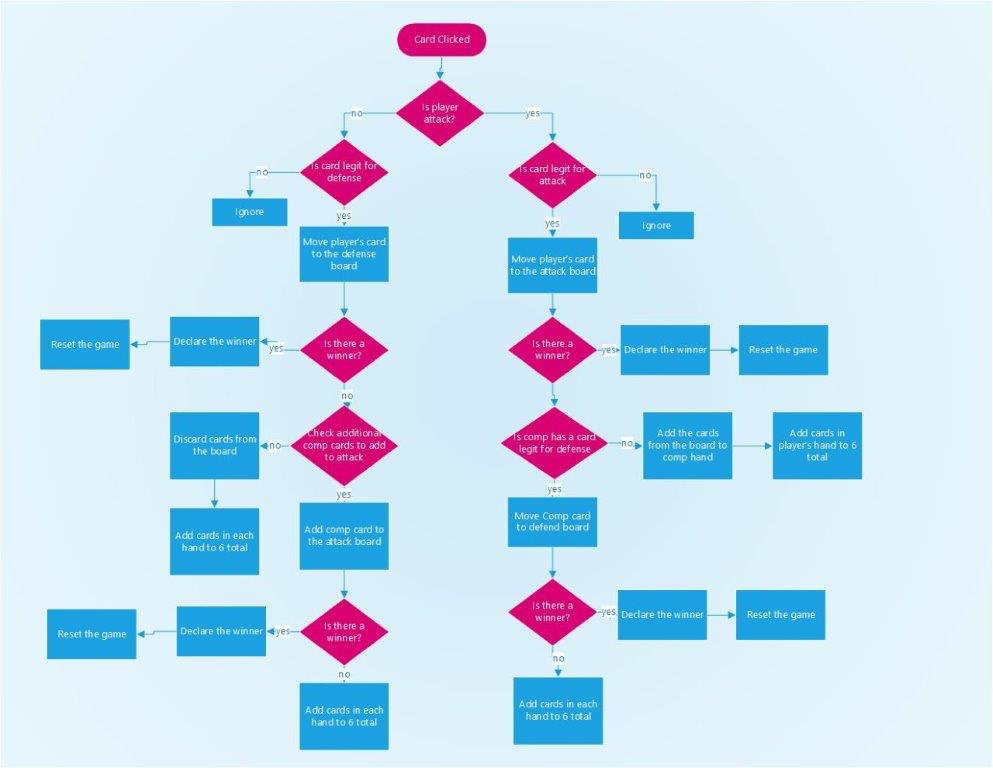

# project1-durakGame
###WDI durak game creation

#Technologies used#

* HTML
* CSS
* vanilla JavaScript
* DOM
* JSON
* jQuery
* localStorage
* Bootstrap
* Bootstrap Modal

#Installation instructions#

Just load the html and enjoy the game!
 
#Approach taken:#

_Planning:_
_Pseudo coding:_
 
I have initially planned the game area of my project on a paper, I drew what I want to see on the screen and how it should be presented.
While drawing the game board on paper I thought about how the game is played and ideas how I can implement them. For example, I knew that I need a cards API or JSON file, I make comments that I need to create JSON file (that includes 36 objects), use shuffle cards function, divide 6 cards to player and make trump card and pile cards. While writing the requirements I wrote comments of how can I do that in js, for example, cards are popped from the pile and pushed to player hands.
I wrote how many global variable I will need and what they are. (You can see implementation in my js file).
I had to add the cards through DOM to my HTML. That brought an issue of updating Ui through js, so I wrote on a paper all the functions I need for UI update and need to separate between UI functions and data functions.
_I wrote what should happened in the initiation of the game:_
1.     The cards from JSON file should be shuffled

2.     6 cards are added to player’s hands by popping them from the pile and pushing to players, same with trump card.

3.     First attacks the player with the lowest trump card in his hand, this I will check and announce to the player on game board.

 

I thought of how user plays, he/she need to click on a card for attack/defense and I needed to add a button for possibility for user to pick up the cards or discard them.
I did flow chart for the on-click events for attack/ defense process and it is presented hereunder:

_Execution:_
1.     JSON file of cards was created.

2.     Basic HTML file based on the planned scheme.

3.     Basic CSS for sizing and viewing on the screen.

4.     JS file creating all the arrays and initiation functions to see cards on the screen.

5.     Wrote function by function for player and computer attack and defense with the help of the flowchart, while checking if everything works as desired after each function addition.

6.     Added game instructions using bootstrap modal.

7.     Edited my HTML and CSS for better presentation on the screen.

#Unsolved problems#
_Things I would love to accomplish later:_
*Make it accessible on mobile screen
*Make the computer attacks/defends more complicated, by adding possibilities of response.
 
 
 
 

 

